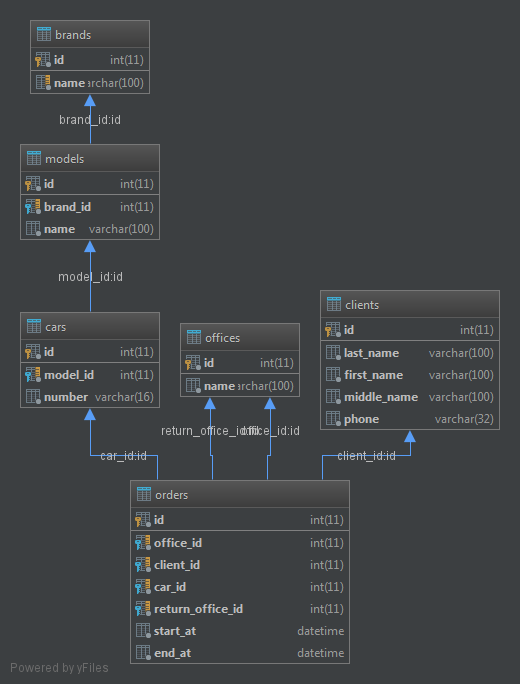

Прокат автомобилей
==================

Установка и запуск
------------------

Для установки приложения нужно выполнить следующие команды:

```bash
# склонировать репозиторий
$ git clone https://github.com/phjedi/car-rental car_rental
$ cd car_rental

# установить зависимости и, после, указать настройки для подключения к бд
$ composer install

# создать бд, схему и загрузить тестовые данные
$ php bin/console doctrine:database:create
$ php bin/console doctrine:schema:create
$ php bin/console doctrine:database:import files/data.sql

# запустить web-сервер
$ php bin/console server:run
```

Теперь вы можете перейти к приложению в браузере по адресу <http://localhost:8000>.

Структура БД
------------

Была разработана следующая схема бд:



И соответсвующие сущности:

* Client - клиент (арендатор)
* Car - автомобиль
* Model - марка авто
* Brand - модель авто
* Office - точка проката
* Order - заказ

Примечание
----------

При проведении анализа предметной области было установлено, 
что для ведения учета автомобилей необходима возможность 
управления автомобилями, клиентами (арендаторами) и заявками.

По данному заданию было принято решение о следующем:

* При создании заказа необходимо проверять свободен ли авто на указанный период
* Подразумевается, что по заказам ведётся исторический учёт 
и нет необходимости отслеживать активные заказы
* Поэтому добавление в историю осуществляется без учета местоположения авто (точки проката)
* Предполагается, что автомобиль выдается на период кратный суткам

В результате были разработаны следующие разделы:

* История - отображение всех заказов
* Добавление заказа в историю
* Просмотр, добавление и редактирование автомобилей
* Просмотр, добавление и редактирование клиентов

В работе использовались следующие библотеки:

* Bootstrap - для создания интерфейса
* jQuery - для реализации ajax

Для symfony были разработаны следующие компоненты:
* Расширение форм HelpExtension - отображения подсказки для полей форм
* Валидатор FreeCarValidator - проверка занятости авто при создании заказа


> В ходе разработки возникилки идеи реализвать следующие фичи (вне тз):
> 
> * Добавить местоположение авто (точка проката, где он находится)
> * При добавлении заказа выводить список авто из точки проката, куда обратился клиент
> * Создать страницу со списком активных заказов, где будут выводится авто, 
> находящиеся на стадии резерва или в прокате с кнопками, например, 
> отмена для резерва и возврат для проката
> 
> Данный функционал не рализован ввиду того, что это не оговорено в задании. 
